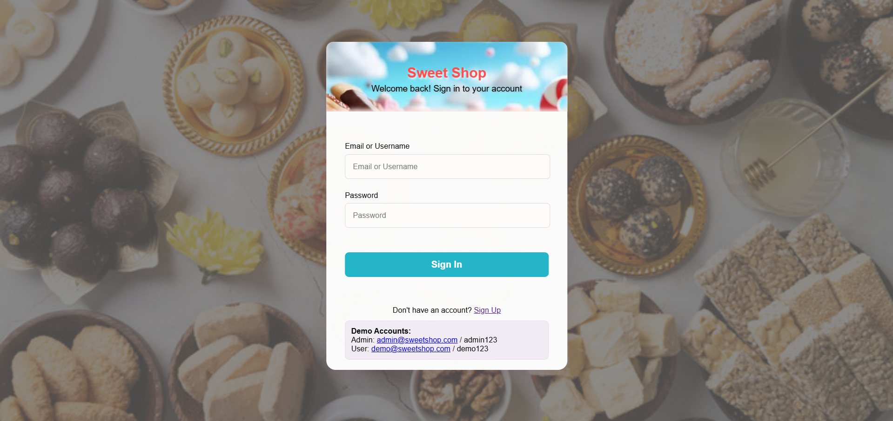
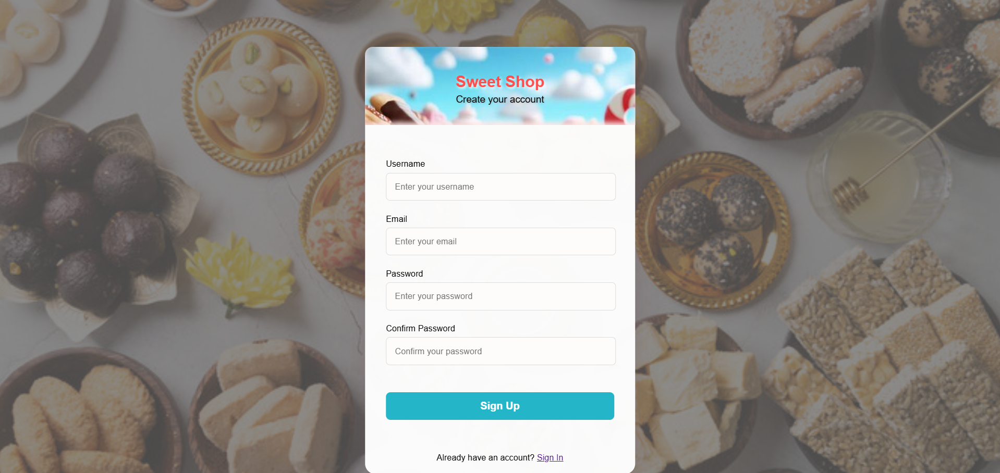
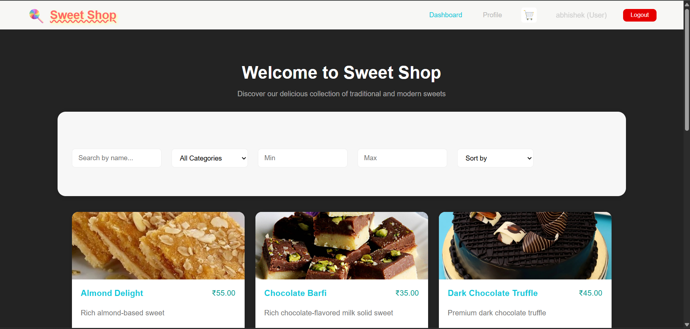
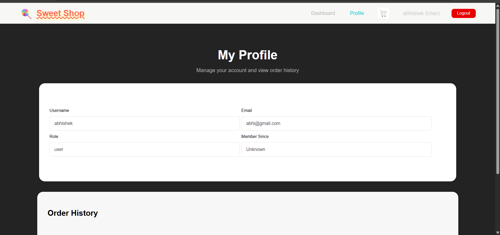
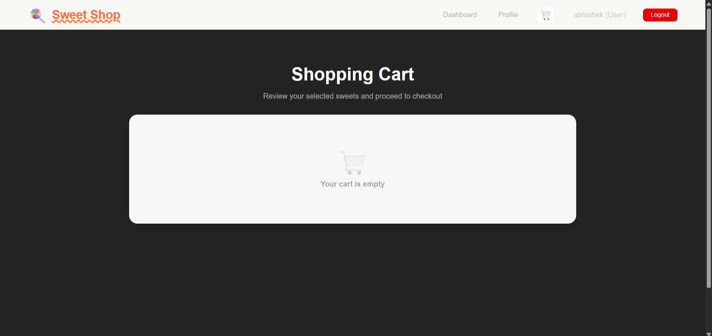
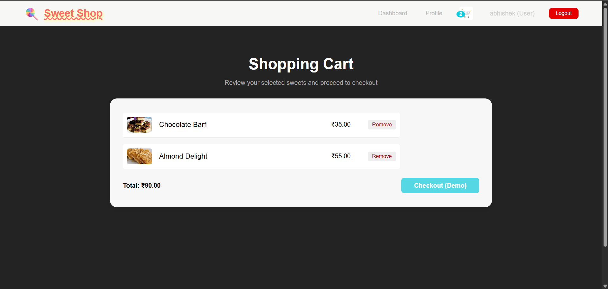

# Sweet Shop Management System

## Project Description

The Sweet Shop Management System is a full-stack web application that allows users to browse, search, filter, and purchase sweets through an intuitive React frontend and a secure FastAPI backend. It includes features like user registration, login with JWT authentication, product catalog management, and cart functionality to enhance the digital retail experience of a sweet shop.

---

## Setup and Installation

### Backend

1. Ensure Python 3.9+ is installed.
2. Navigate to the backend directory:
cd backend
3. Create and activate a virtual environment:
python -m venv venv
source venv/bin/activate # On macOS/Linux
venv\Scripts\activate # On Windows
4. Install dependencies:
pip install -r requirements.txt
5. Run the backend server:
uvicorn app.main:app --reload

Backend server will start on `http://localhost:8000`

---

### Frontend

1. Ensure Node.js 14+ and npm are installed.
2. Navigate to the frontend source directory:
cd src
3. Install dependencies:
npm install
4. Run the frontend dev server:
npm start

Frontend will be available at `http://localhost:3000`

---

## Features

- User registration and JWT token-based login.
- Browse and search sweets by name, category, and price range.
- Sort sweets by price and name.
- Add sweets to a shopping cart with quantity control.
- View and edit user profile with membership info.

---

## Screenshots

  
  
  
  

---

## My AI Usage

I used OpenAI's ChatGPT extensively for this project to:

- Generate backend and frontend code for authentication and UI.
- Debug and solve complex issues quickly.
- Create README and documentation content.
- Improve development flow and reduce boilerplate time.

AI helped me focus on architecture and made problem-solving faster and more efficient.

---

## Contact

For questions or support, please contact amitarj8006@gmail.com.

